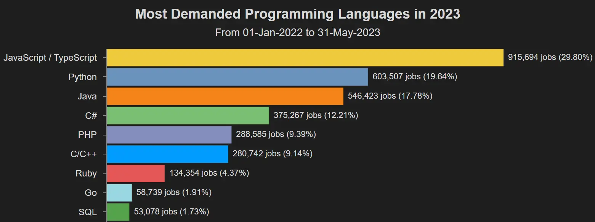

== Fundamentos de programación

=== Estructura de un programa

Un programa es un conjunto de instrucciones codificadas que una
computadora puede ejecutar para realizar una tarea específica o resolver
un problema.

____
Formalmente definimos un algoritmo como un conjunto de pasos,
procedimientos o acciones que nos permiten alcanzar un resultado o
resolver un problema.
____

Los programas están escritos en lenguajes de programación y son creados
por programadores. Los programas pueden variar en complejidad, desde
simples scripts que realizan una acción básica hasta sistemas operativos
completos que gestionan los recursos de una computadora.

=== Lenguajes de programación

Un lenguaje de programación es un sistema formal diseñado para expresar
instrucciones que una computadora puede interpretar y ejecutar. Estos
lenguajes permiten a los programadores escribir programas que realizan
tareas específicas, desde operaciones simples hasta aplicaciones
complejas. Los lenguajes de programación proporcionan una manera de
comunicarse con la computadora utilizando una sintaxis y semántica
específica.

Algunas características clave de los lenguajes de programación incluyen:

* *Sintaxis*: El conjunto de reglas que define cómo se deben escribir
las instrucciones y declaraciones en el lenguaje.
* *Semántica*: El significado de las instrucciones escritas en el
lenguaje.
* *Abstracción*: La capacidad de definir estructuras y operaciones de
alto nivel que oculten detalles complejos.
* *Paradigmas*: Los enfoques o estilos de programación que el lenguaje
soporta, como la programación estructurada, la programación orientada a
objetos, la programación funcional, entre otros.

Existen muchos lenguajes de programación, cada uno con sus propias
características y propósitos. Algunos ejemplos comunes incluyen:

* *Python*: Conocido por su sintaxis clara y legible, es ampliamente
utilizado en ciencia de datos, desarrollo web, automatización y más.
* *Java*: Utilizado en desarrollo de aplicaciones empresariales,
aplicaciones móviles y sistemas integrados.
* *C*: Un lenguaje de bajo nivel que proporciona control detallado sobre
el hardware de la computadora, utilizado en sistemas operativos y
software de sistemas.
* *JavaScript*: Utilizado principalmente en el desarrollo web para crear
aplicaciones interactivas y dinámicas.
* *Ruby*: Conocido por su simplicidad y elegancia, utilizado en
desarrollo web y automatización.

Cada lenguaje de programación está diseñado con ciertos objetivos en
mente y puede ser más adecuado para ciertos tipos de tareas o proyectos.

==== Los lenguajes de programación más utilizados

Estos son los lenguajes de programación con mayor demanda en el 2023.

=== Lenguajes interpretados y compilados

La principal diferencia entre los lenguajes de programación compilados y
los interpretados radica en cómo se ejecutan las instrucciones del
programa:

==== Lenguajes de Programación Compilados

[arabic]
. Proceso de Compilación:

* Compilador: Un compilador traduce el código fuente completo a código
máquina o bytecode antes de que el programa se ejecute. Este proceso se
realiza una sola vez y genera un archivo ejecutable independiente.
* Ejemplo: C, C++, Rust, Go.

[arabic, start=2]
. Ventajas:

* Rendimiento: Los programas compilados suelen ejecutarse más rápido que
los interpretados porque la traducción a código máquina se realiza una
sola vez y el ejecutable resultante está optimizado.
* Optimización: Los compiladores pueden realizar optimizaciones
avanzadas durante la compilación para mejorar la eficiencia del
programa.

[arabic, start=3]
. Desventajas:

* Tiempo de Compilación: El proceso de compilación puede ser lento,
especialmente para programas grandes.
* Portabilidad: El código compilado suele estar ligado a una plataforma
específica, lo que puede dificultar su portabilidad a diferentes
sistemas operativos.

==== Lenguajes de Programación Interpretados

[arabic]
. Proceso de Interpretación:

* Intérprete: Un intérprete traduce y ejecuta el código fuente línea por
línea en tiempo de ejecución, sin generar un archivo ejecutable
intermedio.
* Ejemplo: Python, JavaScript, Ruby, PHP.

[arabic, start=2]
. Ventajas:

* Desarrollo Rápido: No es necesario compilar el código antes de
ejecutarlo, lo que permite ciclos de desarrollo y pruebas más rápidos.
* Portabilidad: Los programas interpretados pueden ejecutarse en
cualquier plataforma que tenga el intérprete adecuado, lo que mejora su
portabilidad.

[arabic, start=3]
. Desventajas:

* Rendimiento: Los programas interpretados suelen ser más lentos que los
compilados porque la traducción a código máquina ocurre en tiempo de
ejecución.
* Optimización: Las oportunidades de optimización en tiempo de ejecución
son limitadas en comparación con la compilación previa.

==== Ejemplos y Consideraciones

* Java: Es un caso interesante porque utiliza un enfoque mixto. El
código Java se compila en bytecode, que es interpretado por la Máquina
Virtual de Java (JVM). Además, la JVM utiliza un compilador JIT
(Just-In-Time) para convertir partes del bytecode en código máquina
durante la ejecución, combinando ventajas de ambos enfoques.
* Python: Aunque es principalmente un lenguaje interpretado, también
puede ser compilado a bytecode (.pyc) para ser ejecutado por la máquina
virtual de Python, lo que mejora ligeramente su rendimiento, pero no
alcanza la velocidad de un lenguaje completamente compilado como C++.

En conclusión, la elección entre un lenguaje compilado y uno
interpretado depende de varios factores, incluyendo la necesidad de
rendimiento, la rapidez del desarrollo, y la portabilidad del código.

=== Python

==== ¿Qué es Python?

Python es un lenguaje de programación popular. Fue creado por Guido van
Rossum y lanzado en 1991.

Se utiliza para:

* Desarrollo web (del lado del servidor),
* Desarrollo de software,
* Matemáticas,
* Inteligencia Artificial,
* Scripting.

==== ¿Qué puede hacer Python?

* Python se puede utilizar en un servidor para crear aplicaciones web.
* Python se puede utilizar junto con el software para crear flujos de
trabajo.
* Python puede conectarse a sistemas de bases de datos. También puede
leer y modificar archivos.
* Python se puede utilizar para manejar Big Data y realizar matemáticas
complejas.
* Python se puede utilizar para la creación rápida de prototipos o para
el desarrollo de software listo para producción.

==== ¿Por qué Python?

* Python funciona en diferentes plataformas (Windows, Mac, Linux,
Raspberry Pi, etc.).
* Python tiene una sintaxis simple similar a la del idioma inglés.
* Python tiene una sintaxis que permite a los desarrolladores escribir
programas con menos líneas que otros lenguajes de programación.
* Python se ejecuta en un sistema de interpretación, lo que significa
que el código se puede ejecutar tan pronto como se escribe. Esto
significa que la creación de prototipos puede ser muy rápida.
* Python se puede tratar de forma procedimental, orientada a objetos o
funcional.

==== Es bueno saber

* La versión principal más reciente de Python es Python 3, que usaremos
en este curso. Sin embargo, Python 2, aunque no se actualiza con nada
más que actualizaciones de seguridad, sigue siendo bastante popular.
* En este curso, Python se escribirá en un editor de texto. Es posible
escribir Python en un entorno de desarrollo integrado, como Thonny,
Pycharm, Visual Studio Code, Google Colaboratory, Netbeans o Eclipse,
que son particularmente útiles cuando se administran colecciones más
grandes de archivos Python.

==== Sintaxis de Python comparada con otros lenguajes de programación

* Python fue diseñado para facilitar la lectura y tiene algunas
similitudes con el idioma inglés con influencia de las matemáticas.
* Python usa nuevas líneas para completar un comando, a diferencia de
otros lenguajes de programación que suelen usar punto y coma o
paréntesis.
* Python se basa en la sangría, utilizando espacios en blanco, para
definir el alcance; como el alcance de los bucles, funciones y clases.
Otros lenguajes de programación suelen utilizar llaves para este
propósito.

==== Instalación de Python

Muchas PC y Mac ya tienen Python instalado.

Para comprobar si tiene Python instalado en una PC con Windows, busque
Python en la barra de inicio o ejecute lo siguiente en la línea de
comandos (cmd.exe):

....
C:\Usuarios\Su nombre>python --version
....

Para verificar si tiene Python instalado en Linux o Mac, en Linux abra
la línea de comando o en Mac abra la Terminal y escriba:

....
python --versión
....

Si descubre que no tiene Python instalado en su computadora, puede
descargarlo de forma gratuita desde el siguiente sitio web:
https://www.python.org/

==== Mi primer programa en Python

[source,python]
----
print("Hola mundo")
----

=== Funciones

Una función es un bloque de código que sólo se ejecuta cuando se llama.
Puede pasar datos, conocidos como parámetros, a una función. Una función
puede devolver datos como resultado.

==== Declarar una función

En Python una función se define usando la palabra clave `def`:

[source,python]
----
def mi_función():
    print("Hola desde una función")
----

==== Llamar a una función

Para llamar a una función, use el nombre de la función seguido de
paréntesis:

[source,python]
----
def mi_función():
    print("Hola desde una función")

mi_función()
----

==== Argumentos

La información se puede pasar a funciones como argumentos. Los
argumentos se especifican después del nombre de la función, dentro del
paréntesis. Puedes agregar tantos argumentos como quieras, simplemente
sepáralos con una coma.

El siguiente ejemplo tiene una función con un argumento (fname). Cuando
se llama a la función, pasamos un nombre, que se usa dentro de la
función para imprimir el nombre completo:

[source,python]
----
def mi_función(fname):
    print(fnombre + " Refsnes")

mi_funcion("Emil")
mi_función("Tobías")
mi_función("Linus")
----

==== Argumentos arbitrarios, *args

Si no sabe cuántos argumentos se pasarán a su función, agregue un __*__
antes del nombre del parámetro en la definición de la función. De esta
manera, la función recibirá una tupla de argumentos y podrá acceder a
los elementos en consecuencia:

[source,python]
----
def mi_funcion(*ninos):
    print("El hijo menor es " + ninos[2])

mi_funcion("Emil", "Tobías", "Linus")
----

=== Referencias

* https://www.w3schools.com/python/[Python en la W3Schools]
* https://www.python.org/[Python.org]
* https://chatgpt.com/[chatGPT en openAI]
* https://lab.anahuac.mx/~hselley/ayp/conceptosBasicos.html[Algoritmos y
Programación]
* https://lab.anahuac.mx/~hselley/mn/python.html[Sintaxis básica en
Python]
